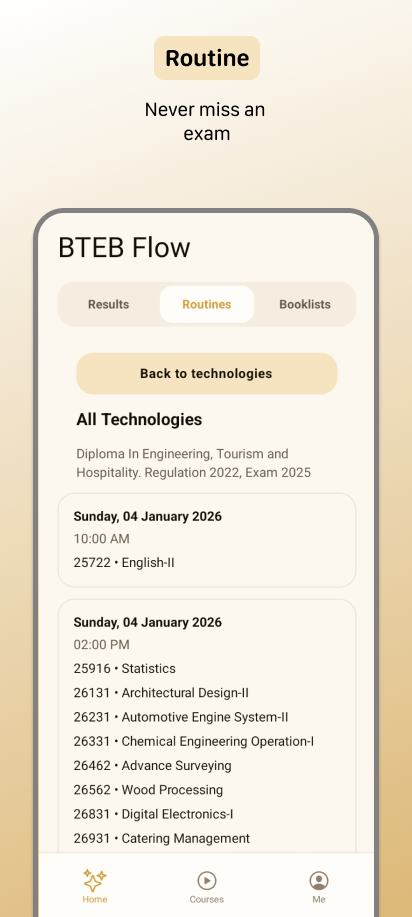
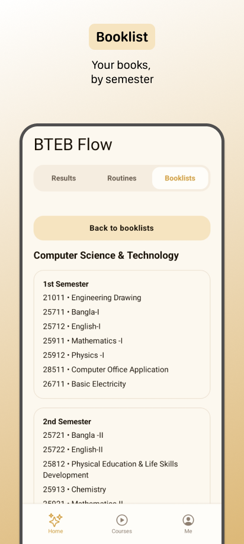
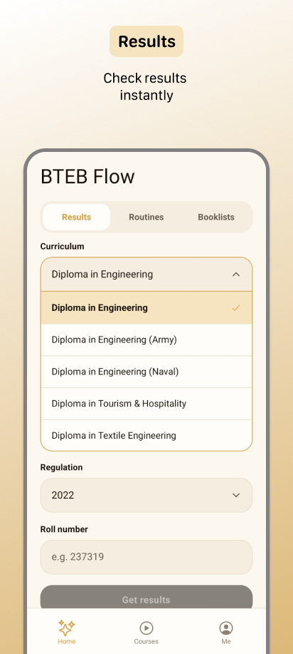
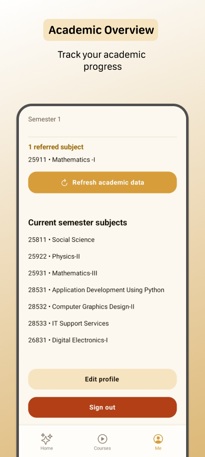

  
# 🎓 BTEB Flow
  
**The ultimate all-in-one companion for Bangladesh Technical Education Board (BTEB) students.**
  

---

Welcome to **BTEB Flow**! 🎉 

Whether you want to check your exam routines, find your semester booklists, or watch course videos, we've got you covered with a fast, modern, and incredibly easy-to-use platform. 

## 🌟 What is BTEB Flow?

BTEB Flow was designed specifically for students to organize their academic lives without any hassle. No more digging through confusing board websites to find a single routine or trying to figure out which books to buy. We bring everything into one simple dashboard.

We offer two easy ways to use our platform:
1. **📱 Android App**: A beautiful, dedicated mobile app tailored specifically for your phone.
2. **🌐 Web Portal**: Access everything directly from your browser on any device (PC, phone, tablet).

---

## ✨ Features

- **📅 Automated Routines**: Stay updated with the latest board exams. Everything is sorted and completely easy to read!
- **📚 Complete Booklists**: Find exactly which books you need for every semester of your diploma course.
- **🎥 Integrated Courses**: Learn directly on our platform with high-quality, curated YouTube course videos built right into the app without distractions.
- **⚡ Super Fast**: Optimized to use less data and load almost instantly!

---

## 📱 App Screenshots

  
  
  
  

---

## 🚀 How to Download the Android App

You can safely download the officially released **BTEB Flow** Android app right here from this repository.

1. 📥 Navigate to the [**Releases**](../../releases/latest) page of this website (look for "Releases" on the right side menu).
2. 📦 Look for the section called **"Assets"** under the latest version.
3. 📲 Tap on the `.apk` file (for example: `BTEBFlow-release.apk`) to download it to your phone.
4. ⚙️ Open the downloaded file and choose **Install**.

> 💡 **Note:** Because you are downloading this directly instead of using the Google Play Store, your phone might warn you and ask you to allow *"Install from unknown sources"*. This is perfectly normal and safe! Just tap "Settings", allow the permission, and continue the installation.

---

## 🌐 How to Use the Website

Don't want to install an app? No problem at all!

Simply visit our web portal from any internet browser (like Google Chrome, Safari, or Firefox):

👉 **[btebflow.vercel.app](https://btebflow.vercel.app/)** 

You'll get the exact same features—routines, booklists, and courses—directly on the web.

---

## 🙋‍♂️ Need Help?

Having trouble downloading the app? Did you spot some incorrect information regarding your booklist or routine? We're here to help!
- Feel free to safely ask a question or drop a suggestion in the [**Issues**](../../issues) tab of this page.

 

  <i>Built with ❤️ for BTEB Students. Let's make learning easier together!</i>

